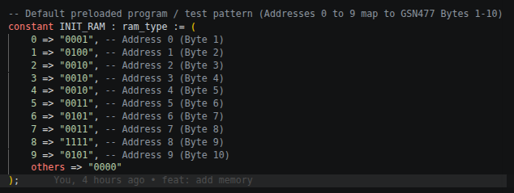
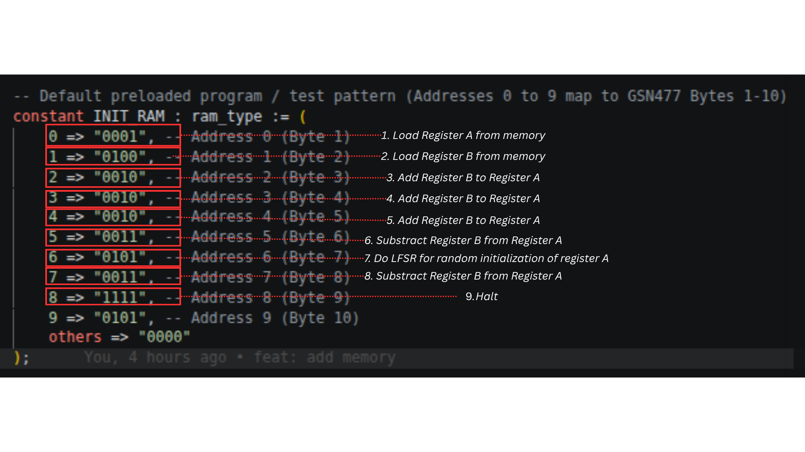
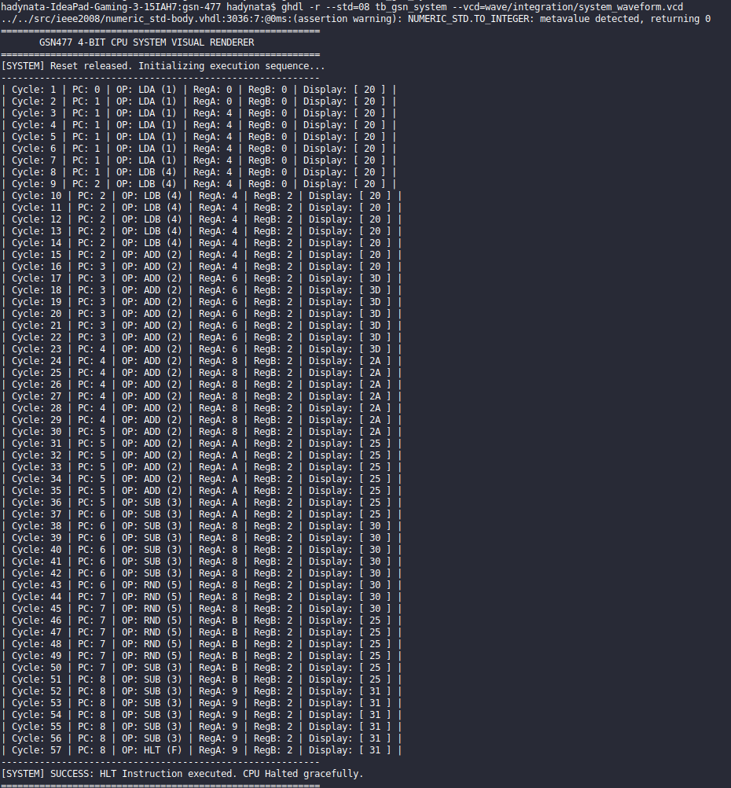
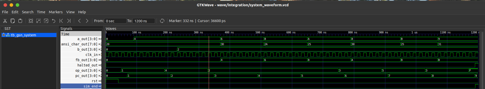

# Global Science Network 477 : 4-bit Computer Implementation

## Brief Intro
A Custom GSN477, a complete 4-bit, micro-instructed CPU designed in VHDL, featuring a modular architecture with a gated clock generator, program counter, ring-counter state sequencer, multi-register file (Accumulators A and B), custom Arithmetic Logic Unit (ALU), Linear Feedback Shift Register (LFSR) for pseudorandom generation, RAM unit, and a framebuffer decoder fgior ANSI character visual output. Connected via a central 4-bit tri-state system bus and orchestrated by an opcode decoder matrix, the processor safely sequences multi-cycle instructions ($T_1$–$T_7$) and includes a terminal-based visual testbench for real-time execution tracing and system verification.

## Architecture


## Specs

## HOW TO CODE
Basically, because I don't design a separate component for storing the instruction, the cpu run the instruction from memory (where it also fetch as its data to be stored into register A and register B). So, basically, you can't program this cpu with separate data as the data itself equals to operand of the operator. So yeah, my bad :'.

Aside from that,  below are the opcodes handled:

> 0000 (NOP): No operation  
> 0001 (LDA): Load Memory value into Register A  
> 0010 (ADD): Add Register B to Register A (A←A+B)  
> 0011 (SUB): Subtract Register B from Register A (A←A−B)  
> 0100 (LDB): Load Memory value into Register B  
> 0101 (RND): Step LFSR and load random value into Register A  
> 1111 (HLT): Assert system halt signal

As per how to program it, you need to directly write those opcodes into the memory in the `memory.vhd`, as given below.



Here, each of the memory is the instruction, so if you want to program you own cpu, you need to change the instruction itself. As we all know, explanation by examples is more preferred as it is more hands-on, so currently in this very version, I implement the program below.

1. Load Register A from memory
2. Load Register B from memory
3. Add Register B to Register A
4. Add Register B to Register A
5. Add Register B to Register A
6. Substract Register B from Register A
7. Do LFSR for random initialization of register A
8. Substract Register B from Register A
9. Halt

So the below is the implementation embedded into the image before.



So you may test it yourself, for example, you want to implement the program below.

1. Do LFSR for random initialization of register A
2. Load Register B from memory
3. Add Register B to Register A
4. Add Register B to Register A
5. Substract Register B from Register A
6. Do LFSR for random initialization of register A
7. Substract Register B from Register A
8. Add Register B to Register A
9. Halt

You just need to implement like so:

```vhd
...
constant INIT_RAM : ram_type := (
    0 => "0101", -- Address 0 (Byte 1)
    1 => "0100", -- Address 1 (Byte 2)
    2 => "0010", -- Address 2 (Byte 3)
    3 => "0010", -- Address 3 (Byte 4)
    4 => "0011", -- Address 4 (Byte 5)
    5 => "0101", -- Address 5 (Byte 6)
    6 => "0011", -- Address 6 (Byte 7)
    7 => "0010", -- Address 7 (Byte 8)
    8 => "1111", -- Address 8 (Byte 9)
    9 => "0101", -- Address 9 (Byte 10)
    others => "0000"
);
...
```

## Prerequisites
0. Ubuntu 22.04 (At least mine, Windows may work, but I haven't tried as I haven't check the compatibility of software below)
1. ghdl
2. GTKWave

## How to test
```shell
# 1. Create target system waveform directory
mkdir -p wave/system

# 2. Analyze all source entities and the system integration testbench
ghdl -a --std=08 src/clock/clock.vhd \
                 src/program_counter/program_counter.vhd \
                 src/ring_counter/ring_counter.vhd \
                 src/a_register/a_register.vhd \
                 src/b_register/b_register.vhd \
                 src/alu/alu.vhd \
                 src/memory/memory.vhd \
                 src/lfsr/lfsr.vhd \
                 src/opcode_decoder/opcode_decoder.vhd \
                 src/framebuffer_decoder/framebuffer_decoder.vhd \
                 src/gsn.vhd \
                 tb/integration/tb_gsn_system.vhd

# 3. Elaborate top-level system testbench
ghdl -e --std=08 tb_gsn_system

# 4. Run system simulation (terminal logs output execution traces and ASCII display frames)
ghdl -r --std=08 tb_gsn_system --vcd=wave/system/waveform.vcd

# 5. Open GTKWave to analyze full system bus, timing states, and register updates
gtkwave wave/system/waveform.vcd
```

## Testbenches
1. Capabilites : doing simple program with a decoder for its result.  






## Further Improvements
1. Do separate instruction registers for storing the instructions only.
2. Implement branch prediction for maximizing the usage of every micro-cycles. 
3. Implement multi-instruction fetch (basically adding more opcode decoders and each opcode decoders need their own the data bus, also with its instruction bus [critical])
4. Implement a systolic-array for testing matrix multiplication (for NPU)
5. Implement parallel execution with multiple CPU (far later)

## Authors
1. Brian A. Hadian (A final-year undergraduate computer science student at Bandung Institute of Technology)
